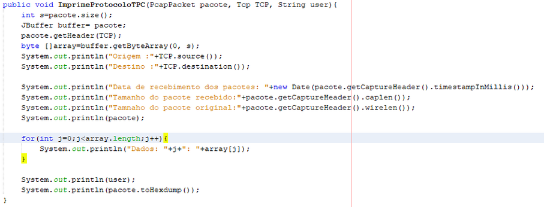
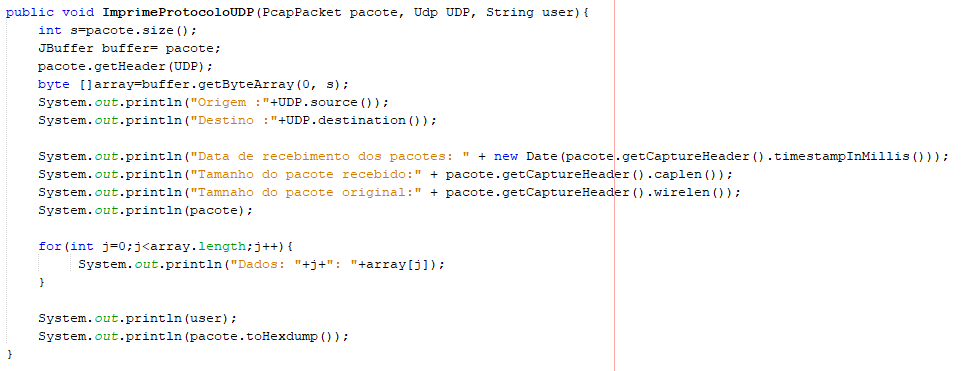
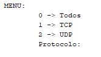

**Documentação Sniffer**

**1- Introdução**

**2 - Descrição do Código Utilizado**

**3 - Descrição da Funcionalidade Adicionada**

**4 - Dependências**

**5 - Alterações**

**1 - Introdução**

`	`Projeto da disciplina de Redes de Computadores objetiva compreender na prática a manipulação de pacote obtidos da rede

`	`O projeto original se encontra em: <https://github.com/alvaroc127/Snifer_Grafica>. O objetivo era utilizar um projeto pronto e realizar alterações para inclusão de funcionalidade.

**2 - Descrição do Código Utilizado**
**
`	`O código utilizado foi desenvolvido na linguagem Java. A sua funcionalidade é listar os pacotes que estão em trafego no dispositivo.
**
`	`O código realiza apenas a captura de pacotes do Protocolo TCP.

**3 - Descrição da Funcionalidade Adicionada**
**
`	`Será desenvolvido, para complementar as funcionalidades do software encontrado, a inclusão de um menu de filtro para que o usuário escolha quais protocolos deseja capturar. Além da inclusão da captura de frames com pacotes UDP.

**4 – Dependências**

`	`Para que o software execute normalmente é necessário a instalação de algumas dependências:

**WinPcap**
**
`	`Disponível em <https://www.winpcap.org/> é ncessário apenas a realização do dowload e execução da instalação.

**JnetPcap**
**
`	`Documentação da biblioteca disponível em: <http://jnetpcap.sourceforge.net/docs/jnetpcap-1.0-javadoc/org/jnetpcap/package-summary.html>, é necessário realizar o dowload em: <https://sourceforge.net/projects/jnetpcap/>

`	`Etapa 1: mover o aquivo jnetpcap.dll para \windos e para \windos\system32

`	`Etapa 2: incluir o diretório da biblioteca nas variáveis de sistema PATH

`	`Etapa 3: adicionar o arquivo jnetpcap.jar nas bibliotecas do projeto

**5 – Alterações**

**Captura dos pacotes**

     

**Impressão de pacote TCP**

     
     
**Impressão de pacote UDP**

     
     
**Menu de protocolos**

     
     

